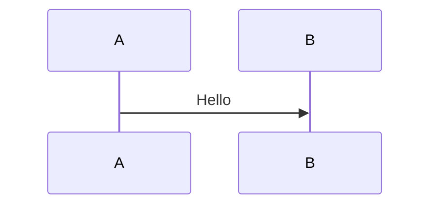

# Marp slide conversion

Convert `.marp.md` files to HTML / PDF / PPTX using Marp (Markdown Presentation Ecosystem).

## Install

```bash
npm install -g @marp-team/marp-cli
```

## Auto-conversion (when the skill is invoked)

Given a file path, **execute the following procedure directly**:

1. Verify install with `npx --yes @marp-team/marp-cli --version`
2. Confirm the input file extension (`.marp.md`)
3. Run the conversion:
   ```bash
   npx --yes @marp-team/marp-cli --html <input>.marp.md -o <output>.html
   ```
4. Confirm the output file exists
5. Report the result path to the user

> **Important**: do not print command suggestions — execute them directly.

## Command reference

```bash
# HTML conversion (permits inline HTML tags)
marp --html input.marp.md -o output.html

# PDF conversion
marp --html --pdf input.marp.md -o output.pdf

# PPTX conversion
marp --html --pptx input.marp.md -o output.pptx
```

> The `--html` flag permits inline HTML tags (`<div>`, `<script>`, etc.) in slides.
> **Required** whenever you need HTML-based features such as Mermaid or checkboxes.

## Mermaid diagram rendering

Marp does not natively support Mermaid. Use HTML + the mermaid.js CDN.

### 1. Use `<div class="mermaid">` instead of a code block

````markdown
<!-- ❌ Does not render in Marp -->


<!-- ✅ mermaid.js renders this -->
<div class="mermaid">
sequenceDiagram
    A->>B: Hello
</div>
````

### 2. Add the mermaid.js script (at the end of the file)

```html
<script type="module">
import mermaid from 'https://cdn.jsdelivr.net/npm/mermaid@11/dist/mermaid.esm.min.mjs';
mermaid.initialize({ startOnLoad: true, theme: 'default' });
</script>
```

### 3. Add CSS styles (in the frontmatter `style` section)

```yaml
style: |
  .mermaid { text-align: center; max-height: 480px; overflow: hidden; }
  .mermaid svg { max-height: 470px; width: auto; }
```

### 4. Mermaid height tuning

The Mermaid SVG can overflow the slide content area (~540px content height on 16:9).

**Recommended default limit**:
```css
.mermaid { max-height: 480px; overflow: hidden; }
.mermaid svg { max-height: 470px; width: auto; }
```

**Per-slide fine-tuning** — for a slide dedicated to a diagram (no heading):
```css
.mermaid { max-height: 560px; }
.mermaid svg { max-height: 550px; }
```

**When the diagram is too small** — use `min-height` instead of `max-height`:
```css
.mermaid svg { min-height: 400px; }
```

### Notes

- Mermaid works **only in HTML output** (does not render in PDF / PPTX)
- To include Mermaid in a PDF: HTML first → open in a browser → Print / Save as PDF
- Do not insert blank lines inside `<div class="mermaid">` — safer without them
- Use height limits together with `overflow: hidden` so clipped edges stay clean

## Checklist (task list) rendering

Marp does not support GitHub-style `- [ ]` checklists.

### HTML alternative

```html
<ul class="checklist">
<li><input type="checkbox" disabled> Item 1</li>
<li><input type="checkbox" disabled checked> Completed item</li>
</ul>
```

### CSS (in the frontmatter `style` section)

```yaml
style: |
  ul.checklist { list-style: none; padding-left: 0; }
  ul.checklist li { margin: 0.3em 0; }
  ul.checklist input[type="checkbox"] { margin-right: 0.5em; transform: scale(1.3); }
```

## Slide overflow fixes

When content exceeds the slide area:

1. **Split the slide**: use `---` to break the content across two slides
2. **Shrink the font**: on that slide, use `<!-- _class: small -->` + CSS `.small { font-size: 20px; }`
3. **Reduce table columns**: convert long URLs into a vertical layout
4. **Confirm 16:9 ratio**: set `size: 16:9` in the frontmatter

## Marp frontmatter template

```yaml
---
marp: true
theme: default
paginate: true
size: 16:9
style: |
  section { font-family: 'Pretendard', 'Noto Sans KR', sans-serif; font-size: 24px; }
  h1 { color: #1a56db; font-size: 36px; }
  h2 { color: #1e3a5f; font-size: 30px; }
  table { font-size: 20px; }
  code { font-size: 18px; }
  pre { font-size: 16px; }
  .mermaid { text-align: center; max-height: 480px; overflow: hidden; }
  .mermaid svg { max-height: 470px; width: auto; }
  ul.checklist { list-style: none; padding-left: 0; }
  ul.checklist li { margin: 0.3em 0; }
  ul.checklist input[type="checkbox"] { margin-right: 0.5em; transform: scale(1.3); }
---
```
