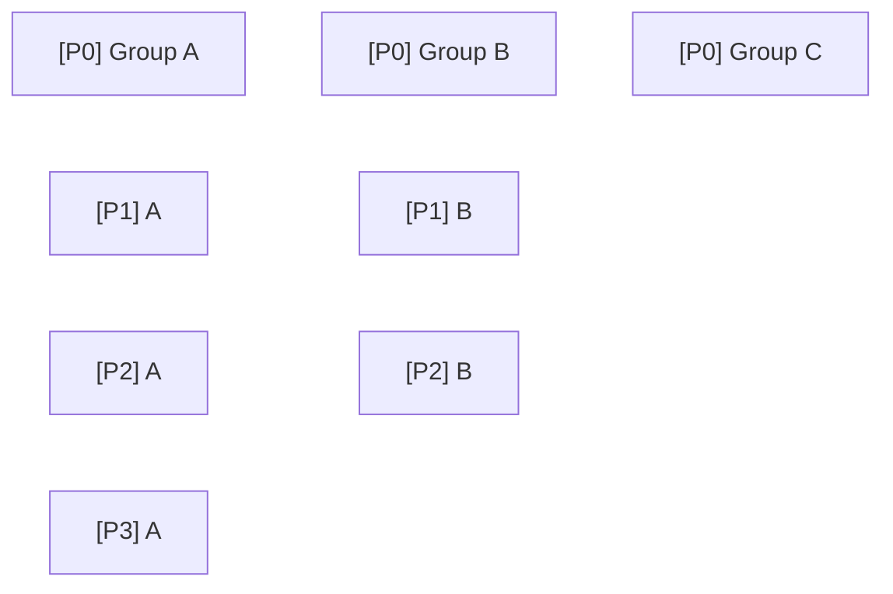

# Flowchart

Standardizes priority flowchart (dependency graph) authoring and plan document mapping in `fix_plan.md` / `checklist.md`.

## When to Use

- Creating or updating the Mermaid dependency flowchart (`graph TD`) in `fix_plan.md` (e.g. under a `## TODO` section).
- Mapping flowchart nodes to specific plan documents (`llm-wiki/outputs/`, `.ralph/plan-drafts/`, `.ralph/docs/generated/`).
- Structuring precedent relationships (`A --> B`) across infrastructure, deployment, and feature plans.
- Invoked via `/fix-plan flowchart` or when managing task execution roadmaps.

## Schema & Placement

Placement: At the top of `fix_plan.md` under a `## TODO` section.

```markdown

## Flow Chart

```mermaid
  graph TD
    VaultSecret["Vault Credentials Index Build"]
    IaC["K3s IaC Share Improvement"]
    K3sAdvance["K3s Advancement"]
    Domain["Domain Registration"]
    Cert["cert-manager Domain Integration"]
    ClawoRuntime["clawo Server Runtime Prep"]
    Clawo["clawo Server Build"]
    Roles["Model Role Allocation"]
    PRAuto["PR Automation"]
    Pipeline["AI Pipeline Build"]
    WikiRAG["Internal Wiki RAG Exposure"]
    PlaneExposure["Internal Plane Exposure"]
    CNPGDrill["CNPG HA Failover Drill"]

    VaultSecret --> Domain
    VaultSecret --> ClawoRuntime

    IaC --> K3sAdvance
    K3sAdvance --> ClawoRuntime
    K3sAdvance --> Cert
    K3sAdvance --> CNPGDrill

    Domain --> Cert
    Cert --> WikiRAG
    Cert --> PlaneExposure

    ClawoRuntime --> Clawo
    Clawo --> PRAuto
    Clawo --> Pipeline
    Roles --> Pipeline
\```
  - **Node Plan Mappings**:
    - **VaultSecret (Vault Credentials Index Build)**: `.ralph/plan-drafts/vault-workspace-credentials-index.md`
    - **IaC (K3s IaC Share Improvement)**: `daegunsoftDev/gitops` (`apps/`, `clusters/dev36/`) / `llm-wiki/outputs/plan-plane-dev36-gitops.md`
    - **K3sAdvance (K3s Advancement)**: `llm-wiki/outputs/plan-plane-dev36-gitops.md` / `llm-wiki/outputs/plan-cnpg-failover-drill.md` / `llm-wiki/outputs/plan-qdrant-oci-deploy.md`
    - **Domain (Domain Registration)**: `.ralph/docs/generated/handoff-cloudflare-letsencrypt-dgs-ai-kr.md` / `.ralph/plan-drafts/wiki-dgs-ai-kr-exposure.md`
    - **Cert (cert-manager Domain Integration)**: `.ralph/docs/generated/handoff-cloudflare-letsencrypt-dgs-ai-kr.md`
    - **ClawoRuntime (clawo Server Runtime Prep)**: `llm-wiki/outputs/plan-clawo-container-completion.md`
    - **Clawo (clawo Server Build)**: `llm-wiki/outputs/plan-webhook-pr-review.md`
    - **Roles (Model Role Allocation)**: `.ralph/plan-drafts/model-role-triage-sonnet-opus-fable.md`
    - **PRAuto (PR Automation)**: `llm-wiki/outputs/plan-webhook-pr-review.md`
    - **Pipeline (AI Pipeline Build)**: `llm-wiki/outputs/plan-clawo-container-completion.md` / `llm-wiki/outputs/plan-webhook-pr-review.md`
    - **WikiRAG (Internal Wiki RAG Exposure)**: `llm-wiki/outputs/plan-wiki-rag-buildout.md` / `.ralph/plan-drafts/wiki-dgs-ai-kr-exposure.md`
    - **PlaneExposure (Internal Plane Exposure)**: `llm-wiki/outputs/plan-plane-dev36-gitops.md` / `.ralph/docs/generated/handoff-cloudflare-letsencrypt-dgs-ai-kr.md`
    - **CNPGDrill (CNPG HA Failover Drill)**: `llm-wiki/outputs/plan-cnpg-failover-drill.md`
```

## Layout ordering — serialize dependency-free items (HARD STOP)

`graph TD` puts every node that has **no incoming edge on the same top row**. A set of
dependency-free items therefore fans out **horizontally** and the chart grows unreadably
wide to the right. Give those items a priority-ordered layout with **invisible ordering
edges** so they stack top-to-bottom instead — without drawing a misleading arrow.

Distinguish two edge kinds:

| Edge | Syntax | Meaning |
|------|--------|---------|
| **Dependency edge** | `A --> B` (solid) | Real prerequisite — A must finish before B |
| **Ordering edge** | `A ~~~ B` (**invisible**) | **No** real dependency — a pure layout hint that ranks B below A by priority. Mermaid draws it `stroke-width:0` (no visible line), so it never implies a prerequisite that doesn't exist |

**Why invisible, not dotted:** ordering is not a relationship at all — even a dotted arrow
suggests a link between two unrelated items. `~~~` still creates the rank constraint that
stacks the nodes vertically, but draws nothing. (Dotted `-.->` is a fallback only for a
Mermaid version that predates `~~~`.)

### Split many items into balanced priority columns (not one tall spine)

Chaining *all* dependency-free items into a single invisible spine only trades a too-wide
chart for a too-tall one. Instead, split them into **K balanced groups** (by theme/domain)
and give **each group its own invisible priority chain** (highest → lowest). Every group
head is a root, so `graph TD` places the heads on the same top rank and the groups render
as **side-by-side columns** — a compact priority grid, not one long line.


> `~~~` edges are **invisible priority-ordering only**, not dependencies.

Because every head is a root and each `~~~` adds one rank, priority levels **align across
columns**: all `P0` on the top row, all `P1` on the next, etc. — a readable grid.

**Alignment caveat:** cross-column rank alignment holds only when a group's priority levels
are **consecutive**. If a group skips a level (e.g. `C0 (P0) ~~~ C2 (P2)` with no `P1`),
that `P2` lands one rank too high and misaligns with the other columns' `P2` row. To force
alignment, insert an invisible spacer node at the skipped level; otherwise accept the local
misalignment.

When a real dependency tree and independent items coexist, keep the tree on solid edges and
give the leftover independent items their own invisible priority columns beside it.

## Sync procedure (pm-role default-pipeline step 5)

The `pm` role's default pipeline (see `SKILL.md` "Default invocation") runs this as its final step, right after `priority` triage produces its sorted `[BLOCKED:P*:reason]` list. This is a **mechanical drift check** against that output — not a full re-authoring pass.

1. **Read** the current `## Flow Chart` Mermaid block and its `Node Plan Mappings` list.
2. **Cross-reference** each `[P*]`-labeled node against the tracker item it maps to (via the Node Plan Mappings entry or an inline reference):
   - **Stale label** — the node's `[P*]` tag no longer matches that item's current `[BLOCKED:P*:reason]` tag → update the label.
   - **Resolved item** — the backing item is now `[x]` / moved to `## Completed` → remove the node and any edges touching it.
   - **New item, no node** — a `[BLOCKED:P*:reason]` item from this run's priority triage references a plan document but has no corresponding node → propose adding one (does not require re-laying-out the whole graph; append per "Layout ordering" above).
   - **Path correction, whole-file grep** — when a Node Plan Mappings entry's document path was stale/wrong and gets corrected, grep the entire tracker file for the same stale path string before considering the correction done. A path can be cited in more than one place — most commonly inside the backing `[BLOCKED]` item's own body (`Why` / `Options` prose) — and fixing only the Node Plan Mappings line leaves those other citations pointing at the old, possibly non-existent path.
3. **Apply** only the drift found — do not redesign layout, columns, or dependency edges beyond what the drift requires. Semantic re-authoring (splitting into new priority columns, adding real dependency edges between unrelated nodes) stays a deliberate `/fix-plan flowchart` invocation, not part of this mechanical step.
4. **Report** `N node(s) relabeled / M node(s) removed / K node(s) proposed` before the pipeline's overall run report closes — mirrors the priority topic's own "N entries auto-resolved" reporting contract (see [priority.md](./priority.md) Don't/Do #4).

| # | Don't | Do |
|---|-------|-----|
| 1 | Skip flowchart sync because "the graph still looks fine" | Cross-reference every `[P*]` node against its tracker item every `pm` run — drift is invisible without the check |
| 2 | Use this step to also redesign columns/layout | Layout redesign is a separate, deliberate `/fix-plan flowchart` call — this step only corrects drift |
| 3 | Silently drop a node for a resolved item without reporting it | Report removed/relabeled/proposed counts, same as priority's sync-resolution reporting |
| 4 | Fix a stale document path only where it was first noticed (the Node Plan Mappings line) and stop | Grep the whole tracker file for the same stale path string and correct every citation, including the backing item's own `Why` / `Options` body |

## Pinned-mission liveness check (pm-role default-pipeline step 5, continued)

Runs immediately after the flowchart-sync procedure above, same `pm`-role scoping, same "mechanical drift check, not a full re-authoring pass" spirit. No-op on a tracker that has no pinned header block.

**Problem this solves**: a tracker's pinned header block (`> 📌 ...` at the top of `fix_plan.md`/`checklist.md`) often names a top-priority mission and prose-cites the backing items that must finish before it. That prose citation rots silently — a cited item can complete weeks before anyone notices the pinned block still calls the mission "in progress," or a cited item's own title can drift out from under the citation entirely. This step makes that citation mechanically checkable instead of trusting prose to stay accurate.

### Citation convention (opt-in)

Append an HTML comment to a pinned bullet line that already has a `**bold label**`:

```markdown
> - **Loop governance adoption**: ... <!-- pinned-backing: todo:"loop-verifier PoC Green", todo:"governance remaining 2 types" -->
```

- `todo:"<substring>"` — the citation lives in `## TODO` (or has moved to `## Completed`)
- `deep:"<substring>"` — the citation lives in `## Deep Tasks` (or has moved to `## Completed`)
- Multiple citations are comma-separated inside one marker; a mission is only a resolved candidate when **all** of its citations resolve.

A pinned bullet with no marker is reported `unmonitored` and never becomes a candidate — **there is no fuzzy-text fallback**. Guessing citations from prose risks a false "this mission is done" claim, which is worse than under-reporting. Adopt the marker line by line as pinned entries are next edited; this is a new convention, not a retroactive requirement.

### Procedure

1. Run `python3 <fix-plan skill>/scripts/pinned_liveness_check.py <tracker-path> [--roadmap-doc=<path>] --json` — reuses the tracker text already in hand from this same pipeline run; no external network calls.
2. For each mission the script reports `resolved`, do **not** auto-write the pinned block. Surface via `AskUserQuestion`: "Pinned mission '<label>' looks resolved (all cited backing items are `[x]`/Completed) — refresh the pinned block?" with:
   - the script's `next_mission_candidate` (sourced from a caller-supplied `--roadmap-doc`, falling back to the highest-priority open `## Deep Tasks` entry) as one option, when present
   - "keep pinned as-is / mark resolved without a new mission" as another option
   - an open-ended "let me name a different next mission" option
3. Report `M pinned entries checked, K resolved-candidate(s) surfaced, N unmonitored` before the run's overall report closes — same reporting contract as the flowchart-sync and priority steps.

### Don't / Do

| # | Don't | Do |
|---|-------|-----|
| 1 | Auto-rewrite the pinned block when the script reports `resolved` | Always confirm via `AskUserQuestion` first — promoting a mission is a user decision, mirroring [draft.md](./draft.md)'s "`[BLOCKED]` not `[ ]`" rationale |
| 2 | Treat an `unmonitored` (no-marker) pinned entry as evidence the mission is still open | `unmonitored` means "not checked," not "open." It is neither a positive nor a negative signal |
| 3 | Guess at a citation from surrounding prose when no marker is present | No fuzzy fallback by design — add the marker instead, then re-run |
| 4 | Treat a citation whose substring is not found anywhere as resolved | The script reports it `unknown`; the mission's overall status is `unknown`, never `resolved`, until every citation is found and checked |
| 5 | Re-poll GitHub/Plane inside this step to check a `pr:`-style citation | v1 supports `todo:`/`deep:` citations only — a PR-backed TODO item is already auto-`[x]`'d by the `sync` step earlier in this same pipeline run, so its completion flows through the `todo:` citation transitively |

### Self-check

1. Does the tracker have a pinned header block at all? If not, this step is a no-op — do not create one solely to run this check.
2. Did the run reuse this same pipeline's already-computed Sync/Priority state (no new external polling)?
3. Was every `resolved`-status mission surfaced via `AskUserQuestion`, never auto-written?
4. Was the `M checked / K resolved / N unmonitored` count reported before the run closes?

## Rules (HARD STOP)

| # | Don't (forbidden) | Do (correct alternative) |
|---|-------------------|------------------------|
| 1 | Append inline `%%` comments inside the Mermaid block next to node definitions | Keep the Mermaid code block clean of inline `%%` comments (prevents Mermaid parser errors). Document mappings belong in the markdown bullet list below |
| 2 | Use `file://` scheme links in document mapping lines | Use clean relative workspace file paths (e.g. `llm-wiki/outputs/plan-*.md`, `.ralph/docs/generated/...`) |
| 3 | Conflate runtime prep with full server build | Split prerequisite server runtime prep (e.g. `ClawoRuntime`) as a separate antecedent node before full server build (`Clawo`) |
| 4 | Leave orphan nodes without precedent or antecedent arrows when dependencies exist | Connect all prerequisite nodes (`A --> B`) to reflect execution order |
| 5 | Leave dependency-free items as unconnected roots (they fan out horizontally), OR chain them all into one over-tall spine | Split them into K balanced priority groups, each an **invisible** vertical chain (`A ~~~ B`, P0→P1→P2…) — heads align as side-by-side columns (see "Layout ordering"). Reserve solid `-->` for real dependencies; use invisible `~~~` (not dotted) for pure ordering |

## Self-check

1. Is the Mermaid graph syntax clean without inline `%%` parse errors?
2. Are node plan mappings formatted as clean relative paths without `file://` URLs?
3. Are precedent relationships (`VaultSecret --> Domain`, `Cert --> PlaneExposure`, `ClawoRuntime --> Clawo`) accurately reflected?
4. Are dependency-free items split into balanced priority columns with **invisible** ordering edges (`~~~`), rather than left as horizontal roots or forced into one over-tall single column?
5. (pm-role runs only) Was every `[P*]`-labeled node cross-referenced against its tracker item's current `[BLOCKED:P*:reason]` tag this run, and was the relabeled/removed/proposed count reported?
6. If a Node Plan Mappings document path was just corrected, was the whole tracker file grepped for the same stale path string, and were any other citations (e.g. the backing item's `Why` / `Options` body) corrected too?
7. (pm-role runs only) Was `pinned_liveness_check.py` run against the tracker, and was every `resolved`-status pinned mission surfaced via `AskUserQuestion` rather than auto-written? See "Pinned-mission liveness check" above.
