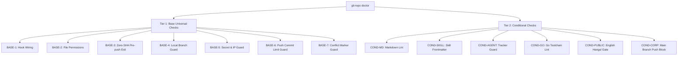

# Git Repository & Hook Doctor

Comprehensive health check and diagnosis for Git repository hooks across universal (Tier 1 Base) and context-specific (Tier 2 Conditional) standards.

## When to Use

- Repository pre-push or pre-commit checks fail unexpectedly or are bypassed
- New repository onboarding or repository hooks audit (`.githooks` vs `core.hooksPath`)
- Branch deletion wastes heavy CI resources in `pre-push`
- Staging and pushing private branches (e.g. `refs/heads/local`) needs protection
- Audit public repositories for secret/Korean text leakage or corporate repositories for direct `main` push protection
- A merge commit's message still shows a leftover `# Conflicts:` block (produced by `git merge --no-edit` or another non-interactive commit path after resolving conflicts)
- User mentions: "repo doctor", "hook health", "diagnose hooks", "check hooks", "hook wiring", "zero-SHA pre-push", "doctor", "Conflicts:", "conflict marker in commit message"

---

## 2-Tier Diagnostic Taxonomy



### Tier 1: Base (Universal) Checks

| ID | Category | Target | Rule & Failure Condition |
| :--- | :--- | :--- | :--- |
| **`BASE-1`** | **Hook Wiring** | `.githooks` vs `core.hooksPath` | If `.githooks/` directory exists, `core.hooksPath` MUST point to `.githooks`. Otherwise Git reads default `.git/hooks` and `.githooks/` is completely unwired/ignored. |
| **`BASE-2`** | **Permissions** | Executable bit (`+x`) | Active hook files (`pre-commit`, `pre-push`, `commit-msg`, etc.) must have executable bits (`chmod +x`). |
| **`BASE-3`** | **Pre-push Deletion** | Zero-SHA early exit | `pre-push` hook must detect remote branch deletion (`local_sha=0000...0000`, `local_ref=(delete)`, or `remote_sha=0000...0000`) and skip heavy CI tests immediately. |
| **`BASE-4`** | **Local Branch Guard** | `local` branch push guard | `pre-push` hook must contain a guard blocking accidental push of private `refs/heads/local` stage branch to remote. |
| **`BASE-5`** | **Secret & IP Guard** | Secret / IP scan | `pre-commit` hook must scan staged files for private RFC1918 IPs (`10.x`, `192.168.x`, `172.16-31.x`) and home paths. |
| **`BASE-6`** | **Push Commit Limit Guard** | Outgoing commit count check | `pre-push` hook must check outgoing commit count (`rev-list --count` / `PUSH_MAX_COMMITS`) and block pushes exceeding the limit (default: 5) to prevent publishing massively diverged commits caused by wrong base branch selection. Override via `PUSH_COMMIT_LIMIT_OVERRIDE=1`. |
| **`BASE-7`** | **Conflict Marker Guard** | Outgoing commit message scan | `pre-push` hook must scan each outgoing commit's message for a literal `Conflicts:` section (the auto-generated merge-conflict listing that `git merge --no-edit`, or any non-interactive commit path, leaves un-stripped) and block the push. Override via `PUSH_CONFLICT_MSG_OVERRIDE=1`. |

### Tier 2: Conditional Checks

| ID | Trigger Condition | Category | Requirement |
| :--- | :--- | :--- | :--- |
| **`COND-MD`** | Repository contains `*.md` | **Markdown Lint** | `pre-commit` or `pre-push` must contain markdown/hangul or link reference validator. |
| **`COND-SKILL`** | Repository contains `skills/*/SKILL.md` | **Skill Frontmatter** | `pre-push` or `pre-commit` must run `lint-frontmatter.sh` or equivalent metadata validator. |
| **`COND-AGENT`** | Workspace is `.agents/` or has `fix_plan.md` | **Tracker Guard** | `pre-commit` must protect against committing untracked/dirty `fix_plan.md`. |
| **`COND-GO`** | `go.mod` is present | **Go Toolchain** | `pre-commit`/`pre-push` must run `gofmt` / `go vet` / `go test`. |
| **`COND-PUBLIC`** | Remote is public (`es6kr/*`) | **Public English Gate** | `pre-commit` must contain `check-hangul` gate to enforce English-only text. |
| **`COND-CORP`** | Remote is corporate (`daegunsoftDev/*`) | **Corp Main Block** | `pre-push` must block direct push to `main` / `master` branches. |

---

## CLI Usage

### Basic Execution

```bash
# Run doctor on current repository
bash skills/git-repo/scripts/git-repo-doctor.sh

# Run doctor on a specific repository path
bash skills/git-repo/scripts/git-repo-doctor.sh /path/to/repo

# Output machine-readable JSON format
bash skills/git-repo/scripts/git-repo-doctor.sh . --json
```

### Sample Output

```text
========================================================================
  Git Repository & Hook Doctor: /path/to/repo
========================================================================
ID         TIER         CATEGORY               STATUS   DETAILS
------------------------------------------------------------------------
BASE-1     Base         Hook Wiring            PASS  core.hooksPath correctly wired to '.githooks'.
BASE-2     Base         Permissions            PASS  All active hook files have executable permissions.
BASE-3     Base         Pre-push Deletion      FAIL  pre-push hook lacks zero-SHA (40 zeros) branch deletion early exit.
BASE-4     Base         Local Branch Guard     PASS  pre-push hook contains 'local' stage-branch push guard.
BASE-5     Base         Secret & IP Guard      PASS  pre-commit hook contains secret / IP / path protection guard.
COND-MD    Conditional  Markdown Lint          PASS  Markdown files present and validated by hook.
COND-SKILL Conditional  Skill Frontmatter Lint PASS  Skill files present and verified by metadata/frontmatter lint hook.
COND-PUBLIC Conditional Public English Gate    PASS  Public English repository contains check-hangul gate in pre-commit.
------------------------------------------------------------------------
Summary: 7 Passed | 0 Warnings | 1 Failed

❌ Doctor found 1 issue(s). Follow details above to resolve.
```

---

## Remediation Runbook

### 1. Fixing Unwired `.githooks` (`BASE-1`)

If `.githooks/` directory exists but Git ignores it:

```bash
git config core.hooksPath .githooks
```

### 2. Fixing Hook Permissions (`BASE-2`)

```bash
chmod +x .githooks/*
```

### 3. Adding Zero-SHA Early Exit (`BASE-3`)

In `.githooks/pre-push`, insert the zero-SHA check at the start of the stdin reading loop:

```sh
while IFS=' ' read -r local_ref local_sha remote_ref remote_sha; do
  # Skip branch deletions immediately (prevents running heavy CI tests on branch deletion)
  if [ "$local_sha" = "0000000000000000000000000000000000000000" ] || [ "$local_sha" = "(delete)" ] || [ "$local_ref" = "(delete)" ]; then
    exit 0
  fi

  # Branch guards & downstream checks...
done
```

### 4. Adding `local` Branch Push Guard (`BASE-4`)

In `.githooks/pre-push`:

```sh
if [ "$local_ref" = "refs/heads/local" ] || [ "$remote_ref" = "refs/heads/local" ]; then
  if [ "${PUSH_LOCAL_OVERRIDE:-}" != "1" ]; then
    echo "❌ ERROR: Pushing 'local' stage branch to remote is blocked." >&2
    exit 1
  fi
fi
```

### 5. Adding Skill Frontmatter & Language Lint (`COND-SKILL`, `COND-PUBLIC`)

In `.githooks/pre-push`:

```sh
# Verify SKILL.md frontmatter and dependencies
if [ -f "scripts/lint-frontmatter.sh" ]; then
  echo "Checking SKILL.md frontmatter..."
  bash scripts/lint-frontmatter.sh
fi
```

### 6. Adding Push Commit Limit Guard (`BASE-6`)

In `.githooks/pre-push`:

```sh
# Commit count limit guard — prevent pushing massive commits from wrong base branch
# Exclude commits that already exist on remote tracking branches (--remotes=origin)
# so that merged upstream/remote branches do not inflate the count of new outgoing commits.
if [ "$remote_sha" != "0000000000000000000000000000000000000000" ] && [ -n "$remote_sha" ]; then
  COMMIT_COUNT=$(git rev-list --count "$local_sha" --not "$remote_sha" --remotes=origin 2>/dev/null || echo 0)
else
  DEFAULT_BASE="origin/main"
  case "$local_ref" in
    refs/heads/feat/*|feat/*)
      if git rev-parse --verify origin/next-feat >/dev/null 2>&1; then
        DEFAULT_BASE="origin/next-feat"
      fi
      ;;
    refs/heads/fix/*|fix/*)
      if git rev-parse --verify origin/next-fix >/dev/null 2>&1; then
        DEFAULT_BASE="origin/next-fix"
      fi
      ;;
  esac

  if [ "$DEFAULT_BASE" = "origin/main" ]; then
    MIN_COUNT=999999
    for cand in origin/next-feat origin/next-fix origin/main origin/master; do
      if git rev-parse --verify "$cand" >/dev/null 2>&1; then
        cnt=$(git rev-list --count "$local_sha" --not "$cand" --remotes=origin 2>/dev/null || echo 999999)
        if [ "$cnt" -lt "$MIN_COUNT" ]; then
          MIN_COUNT="$cnt"
          DEFAULT_BASE="$cand"
        fi
      fi
    done
  fi
  COMMIT_COUNT=$(git rev-list --count "$local_sha" --not "$DEFAULT_BASE" --remotes=origin 2>/dev/null || echo 0)
fi

MAX_COMMITS="${PUSH_MAX_COMMITS:-5}"
if [ "$COMMIT_COUNT" -gt "$MAX_COMMITS" ] && [ "${PUSH_COMMIT_LIMIT_OVERRIDE:-0}" != "1" ]; then
  echo "❌ ERROR: Pushing $COMMIT_COUNT commits on '$local_ref' exceeds the limit ($MAX_COMMITS)." >&2
  echo "   This usually indicates a wrong base branch or diverged history." >&2
  echo "   To override: PUSH_COMMIT_LIMIT_OVERRIDE=1 git push ..." >&2
  exit 1
fi
```

### 7. Adding Merge Conflict Marker Guard (`BASE-7`)

**Why this happens**: `git merge --continue` (or any other non-interactive commit path, e.g. `git merge --no-edit` after resolving conflicts) commits the raw `MERGE_MSG` file verbatim. That file's `# Conflicts:` section is only stripped by Git's "strip" cleanup mode, which applies solely to editor-invoked commits — a non-interactive commit skips it, so the literal `# Conflicts:\n#\t<path>` lines end up permanently in the commit message.

In `.githooks/pre-push`, insert a scan over the outgoing commit range (reuse the `$DEFAULT_BASE`/range logic from `BASE-6` if already present):

```sh
# Conflict marker guard — block push of a commit whose message still carries
# the auto-generated "Conflicts:" residue (unresolved non-interactive merge commit)
if [ "$remote_sha" != "0000000000000000000000000000000000000000" ] && [ -n "$remote_sha" ]; then
  CONFLICT_RANGE="$remote_sha..$local_sha"
else
  CONFLICT_RANGE="${DEFAULT_BASE:-origin/main}..$local_sha"
fi

CONFLICT_COMMITS=$(git rev-list "$CONFLICT_RANGE" 2>/dev/null | while read -r sha; do
  git log -1 --format='%B' "$sha" | grep -qE '^#?[[:space:]]*Conflicts:' && echo "$sha"
done)

if [ -n "$CONFLICT_COMMITS" ] && [ "${PUSH_CONFLICT_MSG_OVERRIDE:-0}" != "1" ]; then
  echo "❌ ERROR: The following commit(s) still contain a leftover '# Conflicts:' section:" >&2
  echo "$CONFLICT_COMMITS" | sed 's/^/   /' >&2
  echo "   This happens when a merge is committed non-interactively (--no-edit) after resolving conflicts." >&2
  echo "   Clean the message before pushing:" >&2
  echo "     - Tip commit:      git commit --amend  (drop the '# Conflicts:' lines, then save)" >&2
  echo "     - Older commit:    git rebase -i <parent-sha>  -> mark it 'reword', drop the lines" >&2
  echo "   To override: PUSH_CONFLICT_MSG_OVERRIDE=1 git push ..." >&2
  exit 1
fi
```

