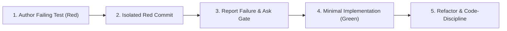

# Implement Topic (`implement.md`)

## 1. TDD Red-Green-Refactor Cycle (HARD STOP)

Test-Driven Development (TDD) is the mandatory default implementation protocol for all code changes.

### The 5 TDD Steps:
1. **Red Test Authoring**: Author test cases before touching product source code. Define the expected behavior or reproduce the reported bug.
2. **Empirical Failure Confirmation**: Execute the test suite and confirm that tests fail for the expected reason (`failures=M`).
3. **Isolated Red Commit**: Stage ONLY test files (`tests/*`) and commit with `test: add failing tests for <scope> (red)`.
4. **Mandatory Ask Gate**: Present the measured failure matrix to the user via interactive selection (`ask_question`). Autonomous progression into Green without explicit approval is strictly forbidden.
5. **Green Implementation**: Implement the minimum necessary product code to make tests pass (100% Green).
6. **Refactor**: Clean up duplication, enforce code discipline, and verify all tests remain Green.
