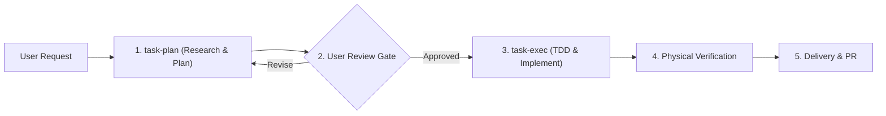

# Pipeline Topic (`pipeline.md`)

## 1. Universal Task Pipeline

The pipeline connects `task-plan` and `task-exec` into a single, cohesive workflow:

---

## 2. Stage Breakdown

### Stage 1: Planning & Research (`task-plan`)
1. **Pre-search**: Run RAG and Qdrant memory lookups to find previous architectural decisions.
2. **Research**: Trace root causes and evaluate technical alternatives.
3. **Draft Deliverable**: Author a 3-tier deliverable (`roadmap-*.md`, `plan-*.md`) containing the 8 mandatory sections.
4. **User Review Gate**: Present the plan to the user and obtain explicit confirmation before proceeding.

### Stage 2: Execution & Implementation (`task-exec`)
1. **Gate Check**: Verify plan approval and active worktree state.
2. **Implementation**: Execute TDD Red-Green-Refactor cycle for code changes, or use doc/mail adapters for non-coding tasks.
3. **Physical Verification**: Run automated tests, frontmatter linters, and regression suites to ensure 100% Green status.
4. **Delivery**: Group logical units via `commit-tidy` and publish Pull Request.
