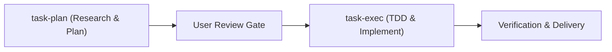

# Pipeline Topic (`pipeline.md`)

## Universal Task Pipeline

1. Run `task-plan` to conduct pre-search, deep research, and draft a 3-tier plan.
2. Pause for explicit user review and worktree setup.
3. Run `task-exec` to execute TDD and code modifications.
4. Verify evidence and finalize the branch via `delivery`.
