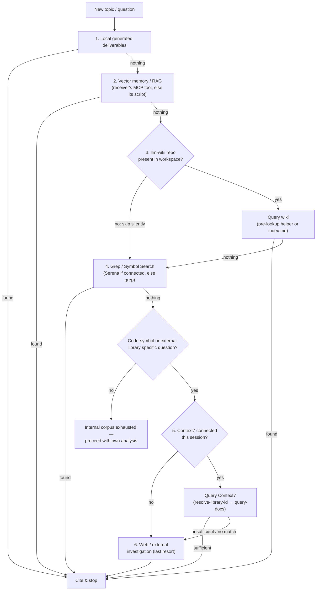

# Pre-Search Topic (`pre-search.md`)

## 1. Overview & Core Philosophy

Before drafting any new plan, architecture document, or technical proposal, an agent MUST conduct a structured pre-search to discover prior decisions, existing codebases, and existing deliverables.

Bypassing pre-search leads to duplicate documents, conflicting architecture directions, and wasted context tokens.

---

## 2. Search-First Ordering Protocol

Always follow this sequence when researching a task. Each tier is consulted only after the previous one produced nothing usable — do not skip ahead, and do not stop at a tier before ruling out that it has anything relevant.

1. **Local Generated Deliverables**: Check `.agents/docs/generated/` and `.agents/docs/` for recent plans and research (`roadmap-*.md`, `plan-*.md`, `research-*.md`).
2. **Vector Memory & RAG**: Query semantic memory across past sessions via the resolved RAG receiver — this generic skill does not assume any specific vendor.
   - Resolve the receiver from the workspace config: `bash <hook-kit-skill>/resources/workspace-config.sh --json` (read `.roles.rag` fields), the same abstract contract `code-workflow`'s Research artifact dispatch uses. An explicit `--rag=<skill>:<topic>` flag at the call site is an optional override, never a requirement.
   - `roles.rag.kind` unset / `"none"` / resolver unavailable — this tier has nothing to query; move on without treating that as an error.
   - `roles.rag.kind` set — query it. **The receiver may or may not expose an MCP tool this session even when the vendor is globally registered** — when no matching tool is present, the receiver's own workspace helper script (invoked directly) is the normal call path, not a degraded fallback.
3. **LLM Wiki**: Check the local wiki for authoritative domain summaries.
   - First verify the workspace actually has one: `find <workspace-root> -maxdepth 2 -iname "llm-wiki" -type d`. If none is found, **skip this tier silently** — its absence is not an error and does not need to be reported as a gap.
   - If present, prefer delegating to that repo's own pre-lookup helper when one exists (see the wiki repo's own `CLAUDE.md`/`AGENTS.md` for the exact invocation) instead of hand-rolling an `index.md`/`log.md` grep.
4. **Codebase Grep / Symbol Search (Serena)**: Verify whether the target capability, interface, or symbol is already partially implemented.
   - Prefer Serena's semantic symbol tools (`find_symbol`, `find_referencing_symbols`, `get_symbols_overview`, project memory `read_memory`) when the Serena MCP is available this session.
   - Fall back to plain `grep`/`Glob` when Serena is not connected, or for searches too coarse to warrant a symbol lookup (plain keyword/config-value hunting).
5. **Context7 (External Library / Framework Documentation)**: When the question concerns an external library, framework, SDK, API, or CLI tool's current behavior, config, or flags — not general programming concepts — query Context7 (`resolve-library-id` then `query-docs`) before relying on training data, which may be stale or wrong about recent versions.
6. **Web / External Investigation (last resort)**: Reach this tier only when either:
   - Context7 is **not connected** in this session (its tools are absent from the deferred/available-tools list), or
   - Context7 was queried but returned no matching library, or its docs did not resolve the question.

   In either case, fall back to `WebSearch`/`WebFetch`, or — per `code-workflow`'s Web Research Policy — a mix of `curl` and browser tools (browser only when JS rendering is required; it is markedly slower). This is the terminal tier: do not consult it before exhausting tiers 1-5, and do not silently stop at "Context7 unavailable" without falling through to it.

**On mem0 vs. this RAG tier**: mem0 was evaluated and explicitly excluded for a closely related corpus (a project's own skill-index, built by a skill-discovery tool). This corpus (local deliverables, Wiki, code, external docs) is likewise "RAG over static, git-versioned documents" — the case mem0's own documentation classifies as already well served by plain RAG. mem0's differentiators (LLM fact-extraction, per-user-scoped memory, expiry) target evolving personal conversational memory, not this kind of corpus, so no separate mem0 adoption is proposed for this tier chain either. Project-specific decision records may cite the concrete comparison in their own wiki/notes; this generic skill does not name that record to stay vendor-neutral.

---

## 3. Canonical Medium Gate (HARD STOP)

Before writing a new plan artifact, verify whether an authoritative medium already exists for this task:

- **Check for Existing Documents**: If a plan for this initiative was already authored, do NOT create a new duplicate plan file. Update the existing document, increment `last_modified`, and record changes in the revision history.
- **External SSOT Confirmation**: If the requested information belongs in an established issue tracker (Plane issue, GitHub PR description, or wiki page), maintain that canonical medium rather than creating isolated local files.
- **Single Source of Truth (SSOT)**: Dispersed duplicate files create synchronization conflicts and cognitive bloat.
